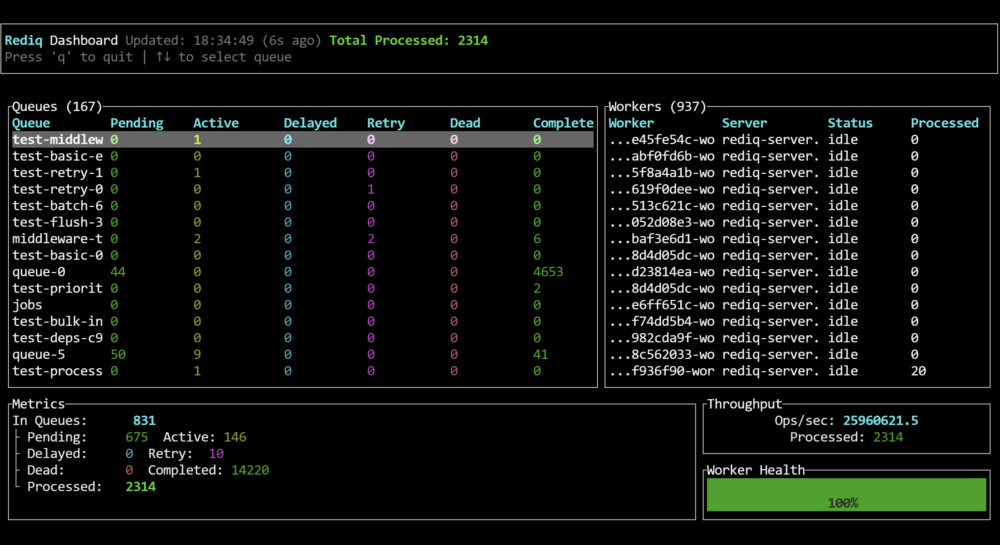

# Rediq

[](https://www.rust-lang.org)
[](LICENSE)

**Rediq** is a distributed task queue framework for Rust, inspired by [Asynq](https://github.com/hibiken/asynq). It provides a robust, production-ready solution for background task processing with Redis as the backend.

## Why Rediq?

Rediq simplifies background job processing in Rust applications. Whether you need to send emails, process payments, generate reports, or handle any asynchronous work, Rediq provides a reliable, scalable solution.

### Key Benefits

- **Simple API** - Intuitive builder pattern for task creation
- **Production Ready** - Battle-tested with retry mechanisms, dead letter queues, and monitoring
- **High Performance** - Built on Tokio with efficient Redis pipeline operations
- **Observable** - Built-in Prometheus metrics and HTTP endpoint
- **Flexible** - Support for priorities, delays, cron, and task dependencies

### Dashboard



## Features

| Feature | Description |
|---------|-------------|
| **Multiple Queues** | Process tasks from multiple queues concurrently with different priorities |
| **Priority Queues** | Execute tasks based on priority (0-100, lower = higher priority) |
| **Delayed Tasks** | Schedule tasks to run after a specified delay |
| **Periodic Tasks** | Cron-style periodic task scheduling (`0 2 * * *`) |
| **Automatic Retry** | Configurable retry mechanism with exponential backoff (2s, 4s, 8s...) |
| **Dead Letter Queue** | Failed tasks are automatically moved to a dead letter queue |
| **Task Dependencies** | Define task execution dependencies (B waits for A to complete) |
| **Middleware System** | Built-in middleware for logging, metrics, and custom hooks |
| **Prometheus Metrics** | Built-in observability with optional HTTP endpoint (`/metrics`) |
| **Redis HA** | Support for Redis Cluster and Sentinel for high availability |

## Quick Start

### Installation

```toml
[dependencies]
rediq = "0.1"
tokio = { version = "1", features = ["full"] }
```

### Basic Example

**Producer (enqueue tasks):**

```rust
use rediq::{Client, Task};

let client = Client::builder()
    .redis_url("redis://localhost:6379")
    .build()
    .await?;

let task = Task::builder("email:send")
    .queue("emails")
    .payload(&serde_json::json!({
        "to": "user@example.com",
        "subject": "Welcome!"
    }))?
    .build()?;

client.enqueue(task).await?;
```

**Consumer (process tasks):**

```rust
use rediq::server::{Server, ServerBuilder};
use rediq::processor::{Handler, Mux};
use async_trait::async_trait;

struct EmailHandler;

#[async_trait]
impl Handler for EmailHandler {
    async fn handle(&self, task: &Task) -> rediq::Result<()> {
        println!("Processing: {}", task.id);
        // Your task processing logic here
        Ok(())
    }
}

let state = ServerBuilder::new()
    .redis_url("redis://localhost:6379")
    .queues(&["emails"])
    .concurrency(10)
    .build()
    .await?;

let server = Server::from(state);
let mut mux = Mux::new();
mux.handle("email:send", EmailHandler);

server.run(mux).await?;
```

## Core Concepts

### Task Lifecycle

```
┌──────────┐      ┌───────────┐      ┌──────────┐
│  Pending │ ───▶ │   Active  │ ───▶ │ Completed│
│          │      │           │      │          │
└──────────┘      └───────────┘      └──────────┘
     │                   │
     ▼                   ▼
┌──────────┐      ┌───────────┐
│  Delayed │      │   Retry   │
│          │      │           │
└──────────┘      └───────────┘
     │                   │
     └───────────────────┘
                 │
                 ▼
         ┌───────────┐
         │    Dead    │
         └───────────┘
```

### Task Options

| Option | Type | Default | Description |
|--------|------|---------|-------------|
| `queue` | `String` | `"default"` | Target queue name |
| `max_retry` | `u32` | `3` | Maximum retry count |
| `timeout` | `Duration` | `30s` | Task timeout |
| `delay` | `Duration` | `None` | Execution delay |
| `priority` | `i32` | `50` | Priority (0-100, lower = higher) |
| `cron` | `String` | `None` | Cron expression for periodic tasks |
| `unique_key` | `String` | `None` | Unique key for deduplication |
| `depends_on` | `Vec<String>` | `None` | Task dependency IDs |

## Advanced Usage

### Priority Queue

Process urgent tasks first:

```rust
let task = Task::builder("urgent:payment")
    .queue("payments")
    .priority(0)  // Highest priority
    .build()?;
```

### Delayed Task

Execute after a delay:

```rust
use std::time::Duration;

let task = Task::builder("scheduled:report")
    .delay(Duration::from_secs(3600))  // 1 hour later
    .build()?;
```

### Periodic Task

Run with cron schedule:

```rust
let task = Task::builder("daily:cleanup")
    .cron("0 2 * * *")  // Daily at 2 AM
    .build()?;
```

### Task Dependencies

Execute tasks in order:

```rust
let task_b = Task::builder("process:b")
    .depends_on(&["task-a-id"])
    .build()?;
// B will wait until A completes
```

### Middleware

Add logging and metrics:

```rust
use rediq::middleware::{MiddlewareChain, LoggingMiddleware, MetricsMiddleware};

let middleware = MiddlewareChain::new()
    .add(LoggingMiddleware::new())
    .add(MetricsMiddleware::new());

let state = ServerBuilder::new()
    .middleware(middleware)
    .build()
    .await?;
```

### HTTP Metrics Endpoint

Enable Prometheus metrics:

```rust
let mut server = Server::from(state);
server.enable_metrics("0.0.0.0:9090".parse()?);
// Access at http://localhost:9090/metrics
```

### Redis High Availability

**Cluster mode:**

```rust
let client = Client::builder()
    .redis_url("redis://cluster-node:6379")
    .cluster_mode()
    .build()
    .await?;
```

**Sentinel mode:**

```rust
let client = Client::builder()
    .redis_url("redis://sentinel:26379")
    .sentinel_mode()
    .build()
    .await?;
```

## CLI Tool

Rediq includes a CLI tool for queue management:

```bash
# Real-time dashboard with history trends
rediq dash

# Dashboard features:
# - Live queue statistics (Pending, Active, Completed, Dead, Retry)
# - Real-time sparkline charts showing historical trends
# - Error rate tracking and visualization
# - Worker status and health monitoring
# - Auto-scaling charts with time range indicators

# Queue operations
rediq queue list
rediq queue inspect <name>
rediq queue pause <name>
rediq queue resume <name>
rediq queue flush <name>

# Task operations
rediq task list <queue>
rediq task inspect <id>
rediq task cancel --id <id> --queue <queue>

# Worker management
rediq worker list
rediq worker inspect <id>

# Statistics
rediq stats --queue <name>
```

See [CLI Reference](docs/cli.md) for complete documentation.

## Documentation

| Document | Description |
|----------|-------------|
| [Getting Started](docs/getting-started.md) | Installation and first tasks |
| [Configuration](docs/configuration.md) | Server, client, and task configuration |
| [Architecture](docs/architecture.md) | System design and internals |
| [API Reference](docs/api-reference.md) | Complete API documentation |
| [Deployment](docs/deployment.md) | Production deployment guide |
| [Troubleshooting](docs/troubleshooting.md) | Common issues and solutions |
| [Benchmark](docs/benchmark.md) | Performance benchmarks |

## Examples

```bash
# Basic usage
cargo run --example quickstart

# Priority queues
cargo run --example priority_queue_example

# Periodic tasks
cargo run --example cron_example

# Task dependencies
cargo run --example dependency_example

# Middleware
cargo run --example middleware_test

# HTTP metrics endpoint
cargo run --example metrics_http_example

# Redis Cluster
cargo run --example cluster_example

# Redis Sentinel
cargo run --example sentinel_example
```

Set `REDIS_URL` environment variable for custom Redis connections:

```bash
export REDIS_URL="redis://:password@host:6379/0"
cargo run --example quickstart
```

## Project Status

Rediq is actively developed and production-ready. Current status:

- ✅ Core task queue functionality
- ✅ Priority queues
- ✅ Delayed and periodic tasks
- ✅ Task dependencies
- ✅ Middleware system
- ✅ Prometheus metrics
- ✅ Redis Cluster/Sentinel support
- ✅ CLI tool with dashboard

See [CHANGELOG.md](CHANGELOG.md) for version history.

## Contributing

Contributions are welcome! Please feel free to:

1. Report bugs
2. Suggest new features
3. Submit pull requests

## License

This project is licensed under either of:

- MIT License ([LICENSE-MIT](LICENSE-MIT) or http://opensource.org/licenses/MIT)
- Apache License, Version 2.0 ([LICENSE-APACHE](LICENSE-APACHE) or http://www.apache.org/licenses/LICENSE-2.0)

at your option.

## Acknowledgments

Inspired by [Asynq](https://github.com/hibiken/asynq) for Go.
